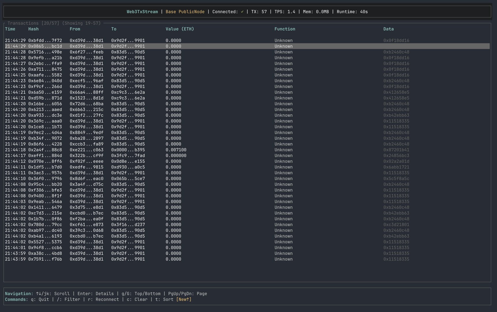
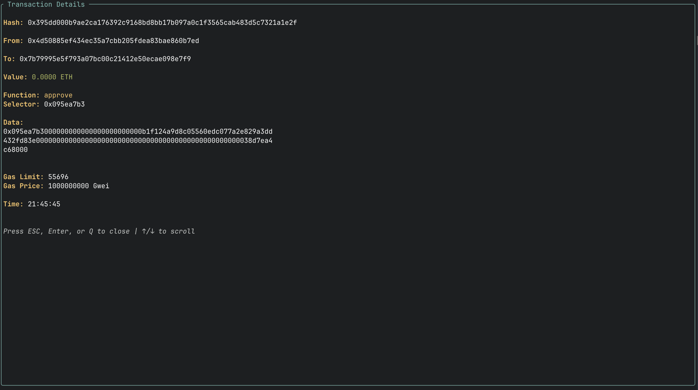
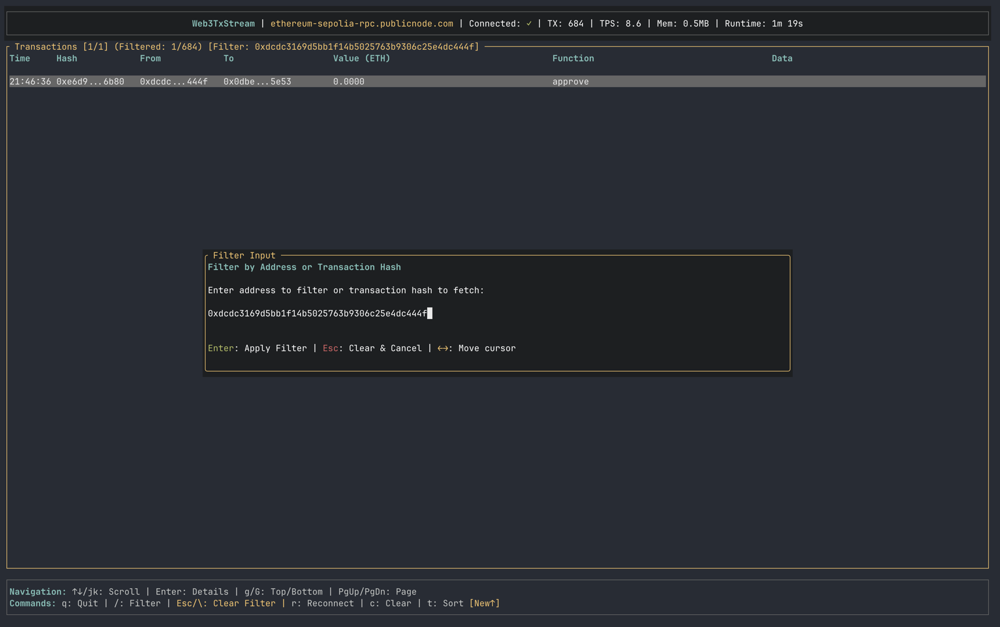

# Web3TxStream

A high-performance terminal user interface for monitoring real-time blockchain transactions on any Ethereum-compatible chain.

## Screenshots


*Real-time transaction monitoring with color-coded function signatures*


*Detailed transaction view with gas usage and decoded functions*


*Filter transactions by address or hash*

## Features

- 📡 Real-time WebSocket connection to any Ethereum RPC endpoint
- 📊 Live transaction monitoring with scrollable list
- 🎨 Color-coded function signatures for easy identification
- 🔍 Detailed transaction view popup with all transaction data
- 🔄 Automatic reconnection on disconnect
- 💾 Memory-efficient circular buffer (max 1000 transactions)
- ⌨️ Full keyboard navigation
- 🔀 Toggle between newest-first and oldest-first sorting
- 🗑️ Clear transaction list on demand
- 🌐 Multi-chain support (Ethereum, Base, Polygon, Arbitrum, Optimism, etc.)

## Installation

```bash
# Build the project
cargo build --release

# The binary will be at:
./target/release/web3-tx-stream
```

## Usage

### Running with Default RPC (Base PublicNode)

```bash
# Using default RPC (wss://base-rpc.publicnode.com)
./target/release/web3-tx-stream
```

### Running with Custom RPC

```bash
# Ethereum Mainnet
RPC_URL=wss://mainnet.infura.io/ws/v3/YOUR-PROJECT-ID ./target/release/web3-tx-stream

# Polygon
RPC_URL=wss://polygon-rpc.com ./target/release/web3-tx-stream

# Arbitrum
RPC_URL=wss://arb1.arbitrum.io/rpc ./target/release/web3-tx-stream

# Any Ethereum-compatible chain
RPC_URL=wss://your-rpc-url.com ./target/release/web3-tx-stream
```

### Testing with Debug Mode

To test the UI with sample data (debug build only):

```bash
# Build debug version
cargo build

# Run with sample data
DEBUG_MODE=1 cargo run
```

## Controls

### Navigation
| Key | Action |
|-----|--------|
| `↑`/`↓` or `j`/`k` | Scroll up/down one transaction |
| `PgUp`/`PgDn` | Page up/down |
| `Home` or `g` | Jump to first transaction |
| `End` or `G` | Jump to last transaction |
| `Enter` | Show transaction details popup |
| `/` | Enter filter mode |
| `Esc` | Exit filter mode or close popup |

### Actions
| Key | Action |
|-----|--------|
| `t` | Toggle sort (new transactions on top/bottom) |
| `c` | Clear all transactions |
| `r` | Reconnect to RPC |
| `q` or `Esc` | Quit (or close details popup) |
| `Ctrl+C` | Force quit |

## Configuration

Environment variables:

- `RPC_URL` - WebSocket RPC endpoint (default: `wss://base-rpc.publicnode.com`)
- `MAX_TRANSACTIONS` - Maximum transactions to keep in memory (default: 1000)
- `RECONNECT_ATTEMPTS` - Number of reconnection attempts (default: 10)
- `RECONNECT_DELAY_MS` - Delay between reconnection attempts in ms (default: 5000)

## UI Layout

```
┌─────────────────────────────────────────────────────────┐
│ Web3TxStream | Ethereum Mainnet | Connected: ✓ | TX: 1K │
├─────────────────────────────────────────────────────────┤
│ Time     Hash         From        To          Value     │
│ 12:34:56 0x1a2b...   0x3c4d...   0x5e6f...   0.001 ETH  │
│ 12:34:57 0x7g8h...   0x9i0j...   0xabcd...   0.000 ETH  │
│ ...                                                     │
├─────────────────────────────────────────────────────────┤
│ ↑/↓: Scroll | q: Quit | RPC: mainnet.infura.io          │
└─────────────────────────────────────────────────────────┘
```

## Supported Chains

Web3TxStream works with any Ethereum-compatible blockchain that provides WebSocket RPC access, including:

- Ethereum Mainnet
- Base
- Polygon (MATIC)
- Arbitrum One
- Optimism
- Binance Smart Chain (BSC)
- Avalanche C-Chain
- Any EVM-compatible chain

## Troubleshooting

### No transactions appearing
- Check your internet connection
- Verify the RPC URL is correct and accessible
- Some chains might have low activity periods
- Try a different RPC endpoint
- Ensure the RPC supports WebSocket connections (wss:// or ws://)

### UI Issues
- Make sure your terminal is large enough (minimum 80x24)
- Try resizing your terminal window
- Some terminals may not support all Unicode characters

## Development

### Building from Source

Requirements:
- Rust 1.70+ (stable)
- Cargo

```bash
git clone <repository>
cd web3-tx-stream
cargo build --release
```

## License

MIT